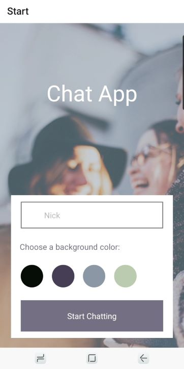

# Chat App

## Objective 

To build a chat app for mobile devices using React Native. The app will provide users with a chat interface and options to share images and their location. 

## User Stories 
- As a new user, I want to be able to easily enter a chat room so I can quickly start talking to my friends and family. 
- As a user, I want to be able to send messages to my friends and family members to exchange 
the latest news. 
- As a user, I want to send images to my friends to show them what I’m currently doing. 
- As a user, I want to share my location with my friends to show them where I am. 
- As a user, I want to be able to read my messages offline so I can reread conversations at any time. 
- As a user with a visual impairment, I want to use a chat app that is compatible with a screen reader so that I can engage with a chat interface. 

## Key Features
- A page where users can enter their name and choose a background color for the chat screen before joining the chat.
- A page displaying the conversation, as well as an input field and submit button.
- Two additional communication features: sending images and location data.
- Data gets stored both online and offline.

## Initial Technical Requirements 
- The app must be written in React Native. 
- The app must be developed using Expo. 
- The app must be styled according to the given screen design. 
- Chat conversations must be stored in Google Firestore Database. 
- The app must authenticate users anonymously via Google Firebase authentication. 
- Chat conversations must be stored locally. 
- The app must let users pick and send images from the phone’s image library. 
- The app must let users take pictures with the device’s camera app, and send them. 
- The app must store images in Firebase Cloud Storage. 
- The app must be able to read the user’s location data.  
- Location data must be sent via the chat in a map view. 
- The chat interface and functionality must be created using the Gifted Chat library. 
- The app’s codebase must contain comments. 

## Tools
- Node.js
- React Native
- Expo
- Google Firebase
- Gifted chat.

## Installation
- Fork or download directly this repo.
- `npm install` or `yarn install` on the terminal to install all dependencies.

## How to use this app
- Download and install the code (see **Installation** for instruction)
- Install Expo globally `npm install --global expo-cli`
- To start the app, run `expo start` or `npm start`
- To run the app on a device, install an emulator or expo go on your smartphone.

## Chat App screenshot

