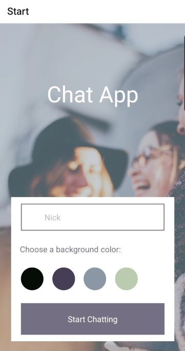
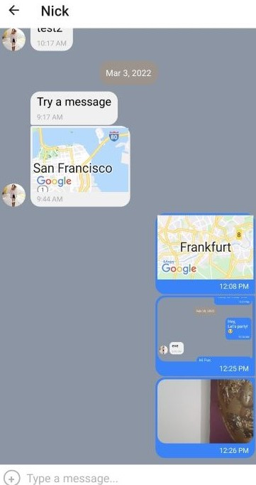

# Chat App. Technical Case Study

## Objective 

To build a Chat App for mobile devices using React Native. The app will provide users with a chat interface and options to share images and their location.

## Context
More and more people use their phones for daily tasks, such as shopping, creating to-do lists, communicating with friends, scheduling meetings, etc. Many companies offer native mobile versions of their web apps or even skip the process of creating a web app entirely.

In the past, building high-quality mobile apps required a lot of time and money because writing apps for different platforms like iOS and Android required specialized programmers who could develop and maintain multiple codebases.

Over time, however, new technologies emerged that made it easier for companies to build and maintain mobile applications using familiar syntax. One of these technologies is React Native, a framework for building Android and iOS apps that only requires one codebase.

## Project Deliverables Acknowledgement
- CareerFoundry (25.02.2021 - 17.03.2022)

## Project Improvement Strategies
- Nick Balan (18.03.2022 - Current)

## My Role
- Full-Stack Web Developer

## The 5 W's
- Who? — The users of the mobile chat app. These could be my friends, family, or other students on the Full-Stack Web Development course. My codebase can also be used by other developers working on the product
- What? — A native chat app built with React Native, as well as all the relevant documentation
- When? — Whenever users of my chat app want to communicate with each other
- Where? — The app is optimized for both Android and iOS devices. It uses Expo to develop the app and Google Firestore to store the chat messages
- Why? — Mobile chat apps are among the most commonly downloaded and used apps globally, so knowing how to build a chat app is essential for any web developer. The app also demonstrates my React Native development skills.

## User Stories 
- As a new user, I should be able to easily enter a chat room so I can quickly start talking to my friends and family 
- As a user, I should be able to send messages to my friends and family members to exchange the latest news
- As a user, I should be able to send images to my friends to show them what I'm currently doing 
- As a user, I should be able to share my location with my friends to show them where I am 
- As a user, I should be able to read my messages offline so I can reread conversations at any time 
- As a user with a visual impairment, I should be able to use a chat app compatible with a screen reader to engage with a chat interface. 

## Technical Requirements & Solutions 
- The app must be written in React Native 
- The app must be developed using Expo
- The app must be styled according to the given screen design 
- The chat conversations must be stored in Google Firestore Database 
- The app must authenticate users anonymously via Google Firebase authentication
- The chat conversations must be stored locally
- The app must let users pick and send images from the phone's image library 
- The app must let users take pictures with the device's camera app and send them
- The app must store images in Firebase Cloud Storage
- The app must be able to read the user's location data 
- Location data must be sent via the chat in a map view
- The chat interface and functionality must be created using the Gifted Chat library
- The app's codebase must contain comments.

## Key Features
- A page where users can enter their name and choose a background color for the chat screen before joining the chat
- A page displaying the conversation, as well as an input field and submit button
- Two additional communication features: sending images and location data
- Data gets stored both online and offline.

## Installation
- Fork or download directly this repo.
- `npm install` or `yarn install` on the terminal to install all dependencies.

## How to use this app
- Download and install the code (see **Installation** for instruction)
- Install Expo globally `npm install --global expo-cli`
- To start the app, run `expo start` or `npm start`
- To run the app on a device, install an emulator or Expo Go on your smartphone.

## Chat App screenshots

 
